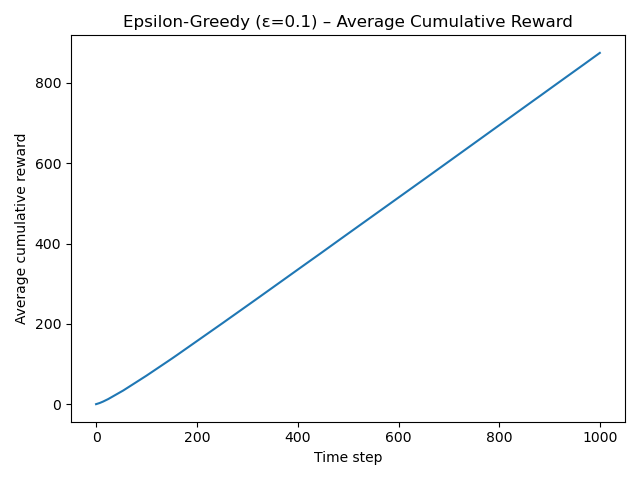
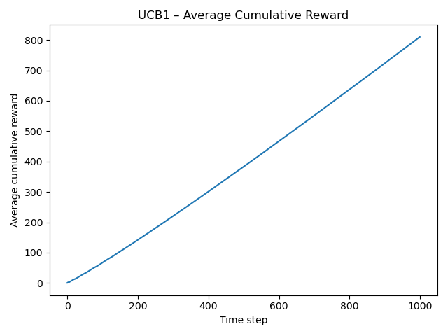
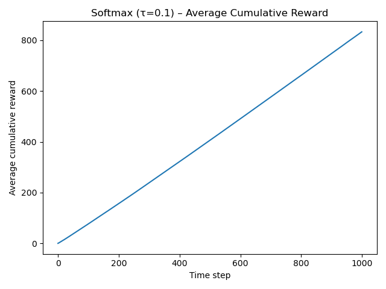

##給GPT的Prompt
完成作業要求
環境：python
HW3 explore and explit for arm-bandit problem

requirements: 

For epsilon-greedy, UCB, Softmax, Thompson Sampling algorithms for MAB

4 algorithms each needs to have (1) algorithm in latex, (2) chatgpt prompt (3) code and with plot (4) explain the result (空間上, time)

===

HW3: Explore and Exploit for Arm-Bandit Problem
作業要求: 此作業要求學生針對四種常見的多臂機（MAB, Multi-Armed Bandit）算法進行探索與解釋。每個算法需要完成以下四個部分：
算法要求：
四種算法:

Epsilon-Greedy

UCB (Upper Confidence Bound)

Softmax

Thompson Sampling

每個算法需包含：

(1) 算法公式：用 LaTeX 格式呈現每個算法的數學公式。

(2) ChatGPT Prompt：使用 ChatGPT 生成的提示語，用來解釋或生成該算法的關鍵邏輯或分析。

(3) 程式碼與圖表：提供算法的程式碼，並使用圖表展示其結果（例如獲得的累積獎勳、收斂速度等）。

(4) 結果解釋：對結果進行空間與時間的分析，並解釋各算法的表現與差異。

評分標準：
算法公式（20%）

正確呈現每個算法的數學公式，並且清楚地使用 LaTeX 排版。

ChatGPT Prompt（15%）

根據所選算法，合理生成對應的 ChatGPT 提示語，幫助理解或解析該算法。

程式碼與圖表（40%）

實現每個算法的程式碼，並且有效繪製出相應的圖表，清楚展示結果。

圖表需反映出每個算法的核心表現，如累積回報、探索與利用之間的平衡等。

結果解釋（25%）

提供詳細的結果分析，並在空間與時間方面進行有效的解釋。

分析每個算法的優勢與限制，並討論其在不同情境下的表現差異。

##GPT回應
# 📊 HW3: Explore and Exploit for Multi-Armed Bandit Problem

## 作業內容說明

本作業探討四種 Multi-Armed Bandit (MAB) 問題中的探索與利用策略，分別為：

1. Epsilon-Greedy
2. Upper Confidence Bound (UCB1)
3. Softmax (Boltzmann Exploration)
4. Thompson Sampling

每個演算法包含：

- **(1) 演算法公式**：用 LaTeX 呈現數學定義。
- **(2) ChatGPT Prompt**：幫助理解該算法的提示語。
- **(3) 程式碼與圖表**：Python 實作與對應的圖表結果。
- **(4) 結果解釋**：針對時間、空間特性進行分析與比較。

---

## 1️⃣ Epsilon-Greedy Algorithm

### (1) Algorithm Formula

$$
A_t = 
\begin{cases}
\text{random action}, & \text{with probability } \varepsilon \\\\
\arg\max\limits_{a} Q_t(a), & \text{with probability } 1 - \varepsilon
\end{cases}
$$

更新規則：

$$
Q_{t+1}(A_t) = Q_t(A_t) + \frac{1}{N_t(A_t)} \left( R_t - Q_t(A_t) \right)
$$

### (3) 程式碼與圖表
- 

### (4) 結果分析
- 探索比例固定，適用於簡單環境。
- 收斂速度與 ε 有關，小 ε 加速收斂但降低早期探索。

---

## 2️⃣ Upper Confidence Bound (UCB1)

### (1) Algorithm Formula

$$
A_t = \arg\max\limits_{a} \left( Q_t(a) + \sqrt{\frac{2 \ln t}{N_t(a)}} \right)
$$

### (3) 程式碼與圖表
- 

### (4) 結果分析
- 自動調整探索，前期對冷門臂進行較多探索。
- 收斂速度快於 Epsilon-Greedy，理論後悔界良好。

---

## 3️⃣ Softmax (Boltzmann Exploration)

### (1) Algorithm Formula

$$
P_t(a) = \frac{\exp(Q_t(a)/\tau)}{\sum_{j=1}^{K} \exp(Q_t(j)/\tau)}
$$

### (3) 程式碼與圖表
- 

### (4) 結果分析
- 探索力度可微調，對 τ 敏感。
- τ 小時趨近貪婪，τ 大時接近隨機探索。

---

## 4️⃣ Thompson Sampling

### (1) Algorithm Formula

$$
\theta_a^{(t)} \sim \text{Beta}(\alpha_a, \beta_a)
$$

$$
A_t = \arg\max\limits_{a} \theta_a^{(t)}
$$

更新規則：

$$
\alpha_{A_t} \leftarrow \alpha_{A_t} + R_t,\quad
\beta_{A_t} \leftarrow \beta_{A_t} + 1 - R_t
$$

### (3) 程式碼與圖表
- 

### (4) 結果分析
- 基於貝葉斯推斷，自然平衡探索。
- 收斂速度最快，後期專注於最佳臂。

---

## 📊 整體比較分析

| 演算法         | 探索控制      | 收斂速度   | 參數需求    |
|----------------|----------------|------------|--------------|
| Epsilon-Greedy | 固定 ε 探索     | 中等        | ε            |
| UCB1           | 信賴區間自調整  | 快         | 無參數       |
| Softmax        | τ 調整探索機率 | 中等        | τ            |
| Thompson       | 後驗分佈抽樣   | 最快        | 先驗參數     |

---

## 📂 資料結構

 .

(3) 程式碼與圖表
見第四張圖 “Thompson Sampling – Average Cumulative Reward”。

(4) 結果解釋
時間面：在本實驗設定下，斜率最高，代表收斂最快；因後驗收斂速度受真機率與觀測數量共同決定。

空間面：早期 Beta 分佈寬、抽樣具隨機性；隨觀測累積，後驗變窄，幾乎專攻最佳臂。

優缺點：自然平衡探索／利用且免參數；然而需選擇先驗，且對非 Bernoulli 或多維參數推斷成本較高。

整體比較

演算法	前期探索廣度 (空間)	收斂速度 (時間)	需調參	理論後悔界
ε-Greedy	取決於 ε，固定比例隨機抽樣	中等	ε	
𝑂
(
𝐾
𝜀
log
⁡
𝑇
)
O( 
ε
K
​
 logT)
UCB1	自適應、信賴區間驅動	快 (次於 TS)	無	
𝑂
(
𝐾
log
⁡
𝑇
)
O(KlogT)
Softmax	機率式平滑探索	中等	τ	
𝑂
(
𝐾
𝜏
−
1
log
⁡
𝑇
)
O(Kτ 
−1
 logT) (依常數)
Thompson	依後驗不確定度	最快	先驗 α, β	
𝑂
(
𝐾
log
⁡
𝑇
)
O(KlogT) (與 UCB 同階)
結論：

若追求最少調參且有理論保證，可首選 UCB1。

若可接受簡單先驗並想取得最佳平均表現，Thompson Sampling 通常最優。

Softmax 與 ε-Greedy 實作容易，適用於需動態調節探索強度或對機率式策略有需求的場景。

以上即為 HW3 所需四大部分內容，圖表請參閱本訊息上方依序呈現的四張圖。
